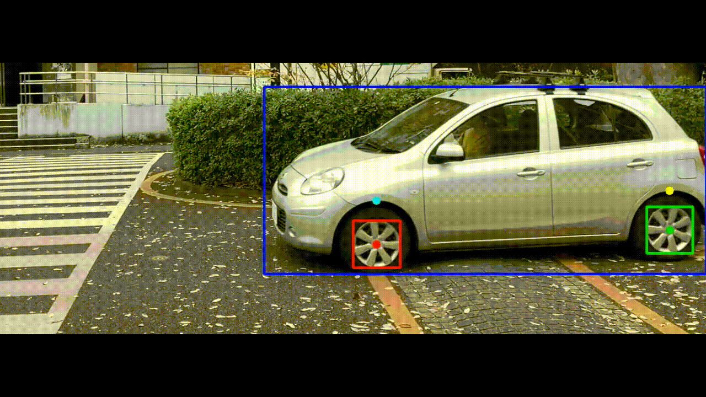
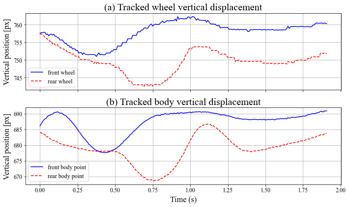
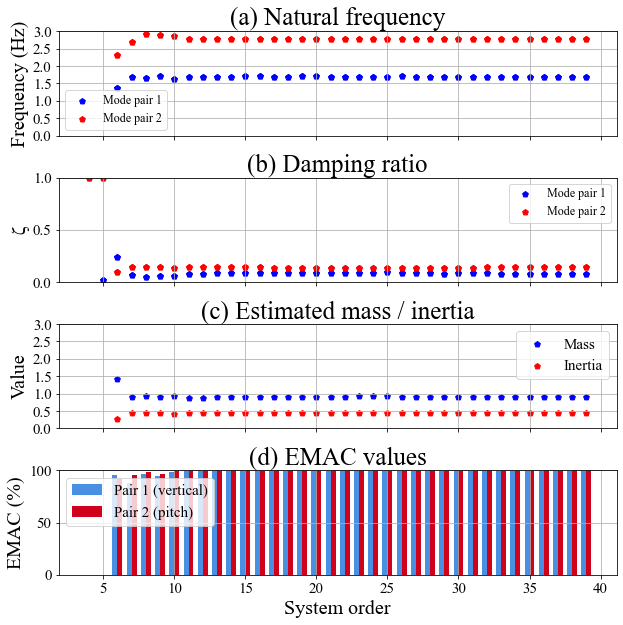

# Vision-based modal identification and weight estimation of vehicles

This repository implements a **vision-based** vehicle weight estimatation using:
- Vision-based wheel & body tracking
- Half-car dynamic modeling
- SRIM-based modal identification
- Weight estimation using complex matrix composition
---

## 🚀 Features

### ✔ 1. Tracking
- YOLOv5 detection
- Subpixel wheel center localization
- Body + wheels response extraction
- Background shift correction

Example of tracking:


This gives you vertical displacement as below:



### ✔ 2. Weight Estimation
- SRIM-based modal parameter extraction
- Filtering
- Complex matrix formulation in state-space using modal parameters

Using SRIM and complex matrix formulation, vehicle body weight can be estimated. System order is a hyper-parameter to select the number of orders in SRIM. If the weight estimation plot (c) is consistent across this value, it means the estimation is stable and reliable.

 In the below case, the weight is estimated as 0.95 ton.
 Natural frequency, damping ratio, and moment of inertia are also estimated.



### ✔ Video Generation
Create a tracking video from detection results:

example:
```python
video_dir = 'Videos/1210_250kg.mov'
output_path = generate_tracking_video(
    video_path=video_dir,
    responses_2d=response_dict,
    fps=fs_tracking/2,
)
```

### ✔ Half-Car Simulation
It can simulate the vehicle behaiors using half-car modeling.
- Vertical bounce + pitch dynamics are simulated from random road profile input excitation.
- Weight estimation method is applied to the simulated vehicle responses,

## 🔧 Installation
Clone the repository

```
git clone https://github.com/atsushiishii-utokyo/Vision-based-weight-estimation.git
```

## 📘 Notebooks Included
#### 1. notebooks/half_car_simulation.ipynb

Includes:

- Half-car dynamic equations

- Road input generation

- Simulated displacement & pitch

- Comparison with experimental tracking

Useful for verifying:

- extracted modal frequencies

- damping ratio

- suspension parameters

- regression stability

#### 2. notebooks/tracking_and_weight_estimation.ipynb

Includes:

- Using real world videos

- Tracking points of vehicle

- Weight estimation

- Video generation of point tracking
