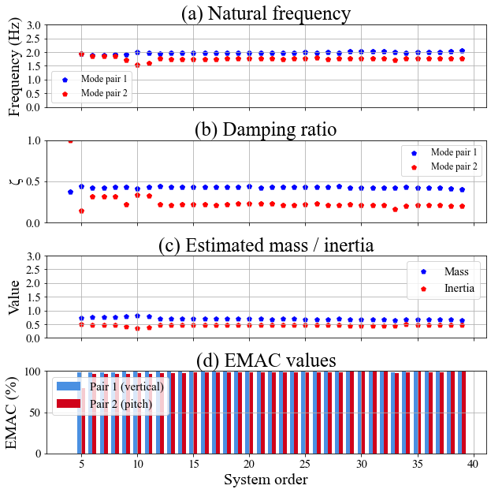
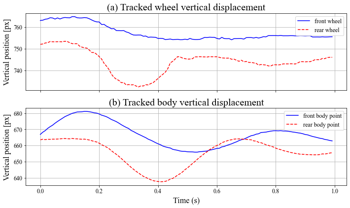
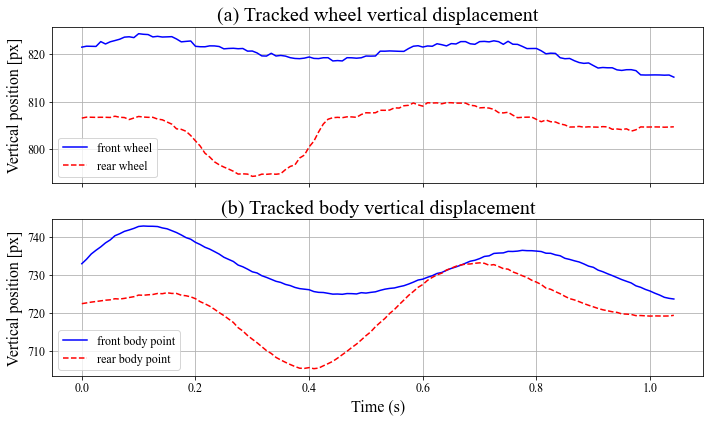
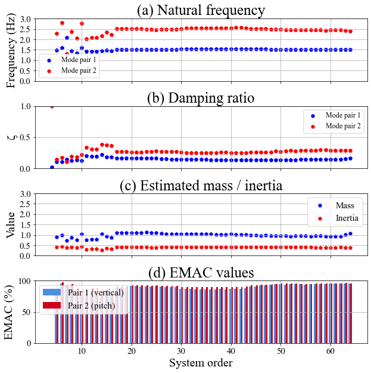
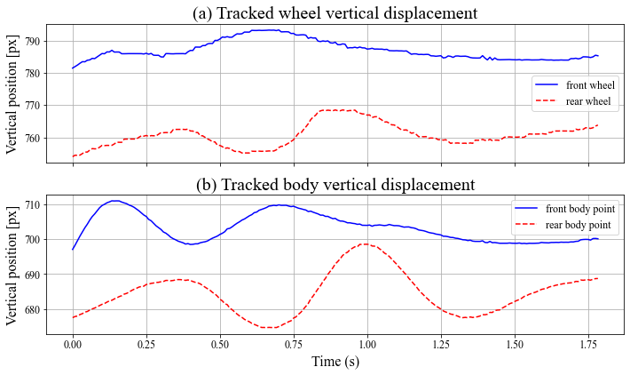
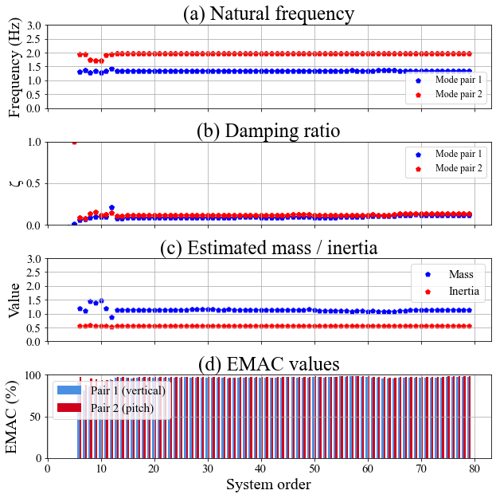
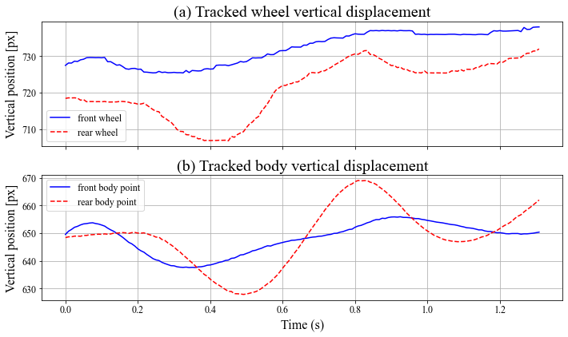
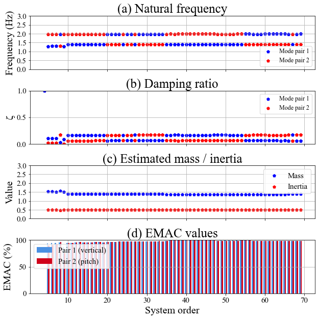

## Examples of weight estimation

| Case | 1 | 2 | 3-a | 3-b | 4 |
|------|---|---|-----|---------|---|
| Reference Weight Value (ton)| 0.90 | 1.025 | 1.15 | 1.15 | 1.4 |

### Case 1
| Estimation | Value |
|------|---|
| Weight (ton)|  0.78|
| Freq. (Hz)|  1.8, 1.9|

#### Tracking

#### Weight estimation

### Case 2
| Estimation | Value |
|------|---|
| Weight (ton)|  0.95|
| Freq. (Hz)|  1.6, 2.7|

#### Tracking

#### Weight estimation

### Case 3-a
| Estimation | Value |
|------|---|
| Weight (ton)|  0.97|
| Freq. (Hz)|  1.6, 2.6|

#### Tracking

#### Weight estimation

### Case 3-b
| Estimation | Value |
|------|---|
| Weight (ton)|  1.1|
| Freq. (Hz)|  1.4, 2.0|

#### Tracking

#### Weight estimation

### Case 4
| Estimation | Value |
|------|---|
| Weight (ton)|  1.4|
| Freq. (Hz)|  1.3, 2.0|

#### Tracking

#### Weight estimation

